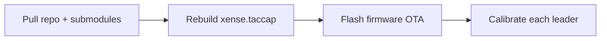

# Versions & Support

The versions this manual is written against, how to check what you have, how to upgrade, and where
to report a problem.

## You must upgrade to the latest versions {#required}

!!! danger "This is not optional — bring all four up to the versions below before collecting"
    The whole chain is a **matched set**: the firmware needs [command set V2.1](#v21) for travel
    calibration, SDK 0.1.7 is what can safely flash that firmware, and the 0–1 normalisation of
    `gripper.pos` only holds once firmware, SDK and calibration are all in place. A leader gripper
    that is uncalibrated or on too-old firmware is **refused a connection outright**, so it cannot
    record data on a wrong scale. But other mismatched combinations can still run to completion and
    write to disk "normally" — the data simply will not line up with anyone else's, and you cannot
    tell from the data afterwards.

| Component | Minimum version | How to check |
|---|---|---|
| `xense-taccap-lerobot` | `0.5.1+xtac.0.0.4` | `pip show lerobot`, or look at `pyproject.toml` |
| `xense.taccap` SDK | **0.1.7** | `python -c "import xense.taccap as t; print(t.__version__)"` |
| Gripper firmware | **command set V2.1**, i.e. build leader **≥ 1.2.0** / follower **≥ 1.1.0** ([the difference](#v21)) | Run [`calibrate.py`](04-calibration.md#41) — if it is too old it prints the current version and exits; to read the version directly see [the command below](#v21) |
| Encoder calibration on every leader | Zero + travel limit written to flash | [4.1 Gripper calibration](04-calibration.md#41) |

### Three numbering schemes: V2.1 is a command set, not a firmware version {#v21}

Gripper firmware involves **three unrelated numbering schemes**. They look alike and mean entirely
different things:

| Number | Current value | What it is |
|---|---|---|
| Wire framing | `V1.8` | How bytes are packed into frames (byte stuffing, CRC). Changes very rarely; this manual barely mentions it |
| **Command set** | **`V2.1`** | **Which commands the firmware implements.** Each command is tagged with the version that introduced it |
| Firmware build | leader `≥ 1.2.0`<br>follower `≥ 1.1.0` | The specific image. **These are minimums, not values you have to match exactly** — 1.2.1 and similar higher builds support V2.1 just as well, and there is no reason to flash back down |

**Everywhere this manual says "V2.1" it means the command set**, because `EncoderMaxCal` — the
command travel calibration uses — is exactly what V2.1 introduced (`V2.0` introduced fisheye
calibration, `V1.9` the LED and the private motor parameters). So "calibration requires firmware
≥ V2.1" is a statement about **the command set** being new enough.

The correspondence is a **threshold, not an equality**: **command set V2.1 is supported from leader
`1.2.0` / follower `1.1.0` onwards**, and higher builds (such as leader `1.2.1`) support it too. So
if you see 1.2.1, there is nothing to puzzle over and nothing to roll back to 1.2.0 — **"the version
we run" and "the version we require" are two different things**. The leader and follower numbers
differ simply because they are two different firmware images, not because one is newer.

One command prints the SDK version and every gripper's firmware build. **The firmware version is not
in the SN** — the SN only gives you the side and the role; the version has to be asked of the
firmware with `GetVersion`:

```bash
python - <<'EOF'
import xense.taccap as t
from xense.taccap import scan_grippers, LeaderGripper, FollowerGripper, Cmd
print("xense.taccap", t.__version__, "(needs >= 0.1.7)")
for ep in scan_grippers():
    cls = LeaderGripper if ep.firmware_sn.endswith("m") else FollowerGripper
    g = cls(mcu_device=ep.mcu_device)          # MCU only; the camera stays closed
    ack = g.transport.send_cmd(Cmd.GetVersion, b"", 500)
    print(f"  {ep.firmware_sn}  {ep.side.name:5}  fw={ack.data[0]}.{ack.data[1]}.{ack.data[2]}")
EOF
```

```text
  TCGU01A28Z0023m  Left   fw=1.2.1
  TCGU01A28Z0024m  Right  fw=1.2.1
```

!!! note "Serial numbers and versions in this guide are **examples**"
    Those two lines are real output from one particular rig, reproduced here so you know **what the
    output looks like**. Your serials will differ and your version may be higher. Everywhere a
    concrete SN appears later in this guide (such as `TCGU01A28Z0023m`) it means the same thing:
    it is an example — go by what your own command prints.

    The only part of the SN you need to read is the **last character**: `m` = leader, `s` =
    follower. That decides which image to flash — see [Firmware OTA upgrade](#ota).

!!! note "Why the gripper objects are constructed this way"
    Only `mcu_device` is passed: the wrist camera is not opened and `normalize_position` keeps its
    default of `False` — so **a gripper that has never had its travel calibrated still reports its
    version** instead of throwing at construction time because the encoder max cannot be read. This
    also does not depend on the SDK's `examples/`, so it works before and after an upgrade.

    The ACK actually carries a **fourth byte, `build`**, which the firmware always writes as 0; the
    SDK displays `MAJOR.MINOR.PATCH` everywhere. Do not put it into a version comparison — the
    four-part `1.2.1.0` form is an obsolete format.

**The upgrade order cannot be shuffled** — each step depends on the one before it:



1. [Pull the repo and its submodules](#repo-update) — the submodule has to come along.
2. **Rebuild the SDK**, or the old and new files will not match and `import xense.taccap` fails
   outright.
3. [Firmware OTA upgrade](#ota) — **must come after step 2**, for the reason given in that section.
4. [Gripper calibration](04-calibration.md#41) — the upgrade itself **does not produce calibration
   values**, and an uncalibrated leader cannot connect.

!!! note "Data you have already collected does not need re-recording"
    What this requires is one consistent set of versions **for collection from here on**. Historical
    data can stay as it is. If you want to mix it with post-upgrade data, first confirm that
    `gripper.pos` is on the same scale in both batches (it is not necessarily identical before and
    after an upgrade + calibration).

## Compatibility baseline {#baseline}

This page lists the "supported range" and the "verified baseline" separately. The actual commands
and fields are still whatever your local checkout says.

| Component | Supported range / constraint | Verified baseline |
|---|---|---|
| OS / architecture | Ubuntu 22.04 / 24.04, **amd64** | Ubuntu 22.04.5 LTS / 24.04.4 LTS, x86_64 |
| Linux kernel | Not a constraint | 6.8 / 6.14 / 7.0 series all verified |
| Collection host (CPU / memory / disk) | **Minimum**: 12th-gen i7, 8 GB RAM, 512 GB SSD. **Recommended**: 13th/14th-gen i7/i9, 32 GB RAM, 1 TB NVMe SSD. Both tiers in [Collection host requirements](02-environment.md#host-spec) | — |
| NVIDIA GPU / driver | **Minimum RTX 3060 / 8 GB VRAM** (RTX 4070 / 12 GB or better recommended), **driver ≥ 570.144**. A machine with no NVIDIA card is on the [degraded path](05-data-collection.md#no-gpu), noticeably less efficient | Driver 570.144 / 580.126.09 |
| Python | **≥ 3.12** (`requires-python` in `pyproject.toml`; `conda_environment.yaml` pins `python=3.12`) | 3.12.13 |
| PyTorch | `torch>=2.2.1,<2.11.0`; `torchvision>=0.21.0,<0.26.0` | 2.10.0 / torchvision 0.25.0 |
| `torchcodec` | `>=0.2.1,<0.11.0`, **aligned automatically to your torch version** by `setup_env.sh` (a mismatch forces a reinstall) | 0.10.0 |
| PyAV | `av>=15.0.0,<16.0.0`; the install script pins **15.1.0** | 15.1.0 |
| `rerun-sdk` | `>=0.24.0,<0.27.0` (used by `--display_data`) | 0.26.2 |
| `opencv-python` | Pinned `==4.12.0.88` (consistent across the XenseRobotics SDKs) | 4.12.0.88 |
| NumPy | `>=1.26.4` | 2.2.6 |
| `xense-taccap-lerobot` | A customisation of lerobot 0.5.1; version `0.5.1+xtac.0.0.6` (kept in step with the doc version) | `main@a7b0d57b` |
| `xense.taccap` (the `taccap-gripper` SDK) | Matched to the main repo's submodule version | 0.1.7 (submodule `83314c8`) |
| Gripper firmware command set | **V2.1** (wire framing is counted separately, at V1.8; see [three numbering schemes](#v21)) | Command set V2.1 |
| Gripper firmware build | leader **≥ 1.2.0** / follower **≥ 1.1.0** supports command set V2.1 | This baseline ships leader **1.2.1** / follower **1.1.1** (firmware source branch `hw_v1.1.0`); image versions follow the SDK — `firmware/manifest.json` is authoritative, see [Firmware OTA upgrade](#ota) |
| `xensesdk` | Provided by the install script | 2.1.1 |
| XenseVR PC Service (`.deb` daemon) | ≥ **v0.2.0**; **install v0.2.1 on a new machine**, reason below | v0.2.1 |
| `xensevr_pc_service_sdk` (the Python interface) | Bundled in the main repo (no longer a submodule); links the C SDK from the `.deb` | 0.2.1 — **the version comes from the `.deb`**, see below |

!!! note "The `.deb` is now the only source of the Pico4 C SDK"
    Building `libPXREARobotSDK.so` used to require cloning the `third_party/XenseVR-PC-Service`
    submodule. That library is now taken straight from the installed `.deb`
    (`/opt/apps/roboticsservice/SDK`), and **the submodule has been deleted**. Two consequences:

    - **A recursive clone drops from about 33 MiB to about 1.6 MiB**, and the install no longer
      links gRPC static libraries.
    - **Updates to this C SDK now arrive with a new `.deb`** — re-running `--install` will not
      rebuild it.

    The script skips packages whose version already matches, so a machine still on **v0.2.0** will
    build the bindings against the old SDK. v0.2.1 is the same daemon with a **rebuilt SDK**, so
    install that one.

!!! note "`pip show xensevr-pc-service-sdk` follows the `.deb`"
    At build time this package asks `dpkg` for the `xensevr-pc-service` version, so what it shows is
    the `.deb`'s version (e.g. `0.2.1`).

    **To decide whether headset camera support is present, check for the interface** — that reflects
    the module actually loaded:

    ```bash
    python -c "import xensevr_pc_service_sdk as xrt; print(hasattr(xrt, 'has_pico_camera_frame'))"
    ```

    The service itself is versioned by `dpkg -s xensevr-pc-service` (see
    [How to check versions](#check-versions)).

!!! note "PC Service v0.2.0 only affects the headset camera"
    Compared with v0.1.0, v0.2.0 does exactly one extra thing: **it relays the headset camera's
    video frames**, which is the path the [headset camera](05-data-collection.md#56) image travels.
    An older headset APK works fine against v0.2.0, so **if you do not use the headset camera
    nothing changes**.

!!! note "Your local checkout wins"
    Commands and fields should be taken from your local copy of the main repo and from the device
    notes shipped with the gripper SDK.

!!! note "The headset camera needs a version after `ffc94d53`"
    The [headset camera](05-data-collection.md#56), the removal of the Insight path and the changes
    to the [`/world` 3D view](05-data-collection.md#world-view) described in this manual come from
    [PR #9](https://github.com/Vertax42/xense-taccap-lerobot/pull/9), merged to `main` as
    `ffc94d53`.

    On an older checkout: `--robot.enable_head_camera` does not exist yet on a single gripper, on a
    bimanual rig it refers to the old Insight camera, and Rerun still draws the TRACKER frame and
    the dashed lines. `git pull --recurse-submodules` + `./setup_env.sh --install` brings you in
    line with this manual.

!!! warning "Submodules now use HTTPS — `ffc94d53` and earlier need a GitHub SSH key"
    Earlier versions used the `git@github.com:` form in `.gitmodules`, so
    [cloning the repo and its submodules](02-environment.md) fails on a machine with no GitHub SSH
    key (the top-level repo clones, the submodule fetch errors out). Everything is `https://` now,
    so any machine can fetch it. The Docker path goes through the same step — the image build only
    checks that the submodule is present; fetching it still happens on the host beforehand.

    **Already upgraded but the submodule still wants an SSH key**: `.gitmodules` is only a template,
    and an older machine's `.git/config` still records the old URL, which `git pull` does not
    rewrite. Sync it once:

    ```bash
    git submodule sync --recursive
    git submodule update --init --recursive --progress
    ```

    **If you have to stay on an old version**, rewrite the URL globally to work around it:

    ```bash
    git config --global url."https://github.com/".insteadOf "git@github.com:"
    ```

!!! note "Refusing to connect an uncalibrated leader needs a version after `4fb5b79b`"
    From that version on, **an uncalibrated leader gripper is refused a connection outright**, so
    you do not have to work out for yourself whether it was calibrated. On an older checkout there
    is no such check, so **be sure to confirm yourself, following [4.1.3](04-calibration.md#41),
    that `gripper.pos` reaches `1.0` when fully open** before recording.

!!! note "Headset pose as an action, and uncompressed display by default, need a version after `f491cae5`"
    Both changes landed after it: `head_camera.*` went from observation-only to **also being an
    action** (see [5.6 Pose and visualisation](05-data-collection.md#56)), and the default for
    `--display_compressed_images` changed from `true` to **`false`**, with
    `--display_image_every_n` added.

    On an older checkout: the headset pose is recorded as an observation only and no policy is asked
    to reproduce it; the Rerun display JPEG-compresses by default, which makes `[slow_frame]` more
    likely with `--display_data=true`.

!!! note "Firmware images 1.2.1 / 1.1.1 need a version after `fc9e9b93`"
    With the submodule at SDK `83314c8`, the images bundled under `firmware/` are leader **1.2.1** /
    follower **1.1.1**; earlier baselines carried 1.2.0 / 1.1.0. **Both support command set V2.1 and
    there is no need to reflash for this** — 1.2.1 only changed the LED colour and blink period. The
    threshold is still leader ≥ 1.2.0 / follower ≥ 1.1.0.

!!! danger "`--robot.id` became required — needs a version after `e8146c4e`"
    From that version on, `lerobot-record` / `lerobot-teleoperate` **require** `--robot.id` and exit
    at command-line parse time without it. Recording also writes a
    [`meta/hardware.json`](05-data-collection.md#robot-id) into the dataset (gripper firmware SNs +
    tactile SNs).

    On an older checkout: `--robot.id` can be omitted and the dataset has **no
    `meta/hardware.json`** — that data cannot say which rig produced it, and only a manual
    [collection record](data-management.md) can. **Every command in this manual is written for the
    new behaviour.**

!!! note "A bare number for `--robot.id` needs a version after `04812536`"
    `--robot.id=0` gets its prefix filled in from `--robot.type` (`taccap_0` / `bi_taccap_0`). On an
    older checkout you have to write the prefix yourself: `--robot.id=taccap_0`.
    **Both versions accept the fully written form**, so `--robot.id=0` in this manual needs
    rewriting on an old version but not the other way round.

!!! note "Encoder selection on a GPU-less host: use a version after `3b9d2deb`"
    From that version on, `--dataset.vcodec=auto` decides whether a hardware encoder exists by
    **actually opening an encoding session**, so a machine with no NVIDIA driver falls back to
    `libsvtav1` automatically and nothing needs specifying. On earlier versions such a host should
    write `--dataset.vcodec=libsvtav1` explicitly. See
    [Recording on a machine with no NVIDIA GPU](05-data-collection.md#no-gpu).

!!! note "The Pico4 C SDK coming from the `.deb` needs a version after `42b44066`"
    The `third_party/XenseVR-PC-Service` submodule was deleted in that version and
    `libPXREARobotSDK.so` now comes from the `.deb`, with the `.deb` baseline raised to **v0.2.1**
    (see the baseline table above).

    On an older checkout: cloning still pulls that submodule, `--install` still compiles the library
    on the spot, and the "only one submodule" statement in
    [2.2 Clone the repo and its submodules](02-environment.md#22) does not match what you have.

!!! note "The apt pre-check in `setup_env.sh` needs a version after `2892929a`"
    From that version on, `--install` first checks for `build-essential` / `cmake` / `pkg-config` /
    `git` / `curl` and stops immediately if any are missing, printing the apt command to run (see
    [Prerequisite: system packages](02-environment.md#apt)). Older versions have no such check and a
    missing package only surfaces at the compile stage — install them per that section first.

!!! note "The Docker delivery image needs a version after `9387ef05`"
    The Docker path in [2. Environment setup](02-environment.md#docker) — the delivery directory,
    `install_customer.sh`, `compose.yaml` — comes from that commit and does not exist in earlier
    versions.

!!! note "Docker defaulting to a GHCR pull needs a version after `854d4cdf`"
    From that version on, `compose.yaml`'s default image is
    `ghcr.io/vertax42/xense-taccap-lerobot` and `.env` **only needs the tag line**. The `.tar`
    offline bundle is still supported but is no longer the default path.

    On an older checkout: the default image is the **locally built** name, and pulling from GHCR
    requires writing both `LEROBOT_IMAGE` and `LEROBOT_IMAGE_TAG` — changing the tag alone does
    nothing.

!!! note "Graphics inside the container needs a version after `93beb2aa`"
    `compose.yaml` changed from `gpus: all` to `runtime: nvidia`. On an older checkout the container
    runs CUDA and `nvidia-smi` fine, but NVIDIA's Vulkan ICD is never injected and **the Rerun
    window will not come up** (`Failed to create surface`). What to do:
    [Graphics from inside the container](02-environment.md#docker-gui).

    Moving to `runtime: nvidia` requires the NVIDIA runtime to be registered with Docker; without
    it you get `Unknown runtime specified nvidia` straight away — see
    [Troubleshooting](troubleshooting.md#docker).

!!! danger "Text-to-speech no longer aborts recording — needs a version after `94597ba2`; the `0.0.5` image **predates** it"
    Each episode is announced by text-to-speech, and the `spd-say` binary it uses is not in the
    image. Before the fix, the first episode's announcement raised, the teardown announcement raised
    again, and the process died — **which means you cannot record in the container at all**. After
    the fix, a missing binary warns once and recording continues.

    **The `0.0.6` image contains this fix**, so `--play_sounds=false` is no longer needed after
    upgrading. Machines still pinned to `0.0.5` or earlier should always pass it — see
    [Troubleshooting](troubleshooting.md#docker). Hosts on the Mamba path with `speech-dispatcher`
    installed are unaffected.

!!! note "Announcements are silent in the container, deliberately so"
    The `0.0.6` image installs `speech-dispatcher` but **no speech synthesiser module**, so the
    announcement is simply skipped. Adding a synthesiser would not get you audio either — there is
    no working audio sink in the container, and `spd-say` goes from failing immediately to hanging,
    wedging a recording at the teardown step. Versions after `d1ad7140` therefore bound that
    blocking call at 10 seconds; the `0.0.6` image predates it, but you only meet the hang if you
    install a synthesiser into the image yourself. **To hear the announcements, record on the host.**

!!! note "Recorded videos readable by non-root — needs a version after `dac15f74`; the `0.0.5` image **predates** it"
    Before the fix, videos landed as `-rw------- root` (the temporary file used for concatenation is
    `0600` and the move preserved its mode), while the metadata beside them is a normal `0644`. The
    consequence only shows up when **exporting**: a non-root copy fails on the `.mp4` files only,
    which reads like a few damaged files.

    **The `0.0.6` image contains this fix too.** But the permissions depend on **the image that
    recorded the data**, and upgrading does not rewrite files already written — so older data still
    has to be exported by **copying as root and then `chown`**, as in
    [Where the data lives](02-environment.md#docker-data).

!!! note "`LEROBOT_DATA_DIR` writes datasets to a host directory — needs a version after `89239c71`"
    Setting it in `.env` puts datasets straight into a host directory you name, with nothing to copy
    out of the container (see
    [Writing datasets straight to a host directory](02-environment.md#docker-data-dir)). Left unset,
    the behaviour is exactly as before: the named volume `lerobot-data`.

    On an older checkout: named volumes only. Landing data in a host directory means editing
    `compose.yaml` — **not advisable**, since it is a tracked file, a hard-coded absolute path
    conflicts on the next `git pull`, and any other machine mounts a path that does not exist.

!!! note "The head camera's 640x480 default needs a version after `4b5f5cea`; the `0.0.6` image **predates** it"
    The headset app's Resolution setting offers `640` / `1024` / `1280` and defaults to `640`
    (640x480 per eye) — but the collection side used to accept only `1024x768` and `1280x960`, and
    defaulted to `1024x768`. With the headset on its own default, `--robot.enable_head_camera=true`
    therefore failed on the first frame's size, and `--robot.head_camera_width=640` was rejected
    outright. `4b5f5cea` adds 640x480 to the whitelist and makes it the default, so the two defaults
    finally agree.

    On an older checkout (the `0.0.6` image included): the head camera runs at `1024` or `1280`
    only — **raise the headset's Resolution first**; at `1024` the command-line defaults match, at
    `1280` add `--robot.head_camera_width=1280 --robot.head_camera_height=960`. The rest of this
    page and [5.6 Headset camera](05-data-collection.md#56) describe the new default (640x480).

!!! note "`--dryrun` was removed; versions after `d46fcf66` no longer accept it"
    The flag printed a line claiming actions would not be sent to the robot and was never actually
    honoured — the hardware ran as usual. It has been deleted, so a script still passing it now gets
    an unknown-argument error; just drop it. This manual never used it.

## How to check versions {#check-versions}

One command prints everything from the table above that lives in the Python environment:

```bash
python - <<'EOF'
import importlib.metadata as M
for p in ("lerobot", "taccap-gripper", "xensesdk", "torch", "torchvision",
          "torchcodec", "av", "rerun-sdk", "opencv-python", "numpy"):
    try:
        print(f"{p:16} {M.version(p)}")
    except M.PackageNotFoundError:
        print(f"{p:16} not installed")
EOF
```

```bash
# xense-taccap / SDK
python -c "import xense.taccap as t; print('xense.taccap', t.__version__)"
python -c "import xensesdk, xensevr_pc_service_sdk; print('xensesdk/pc_service OK')"

# NVIDIA driver (must be >= 570.144 when an NVIDIA GPU is fitted)
nvidia-smi --query-gpu=driver_version,name --format=csv,noheader

# The XenseVR PC Service daemon's deb version (authoritative for the service itself)
dpkg -s xensevr-pc-service 2>/dev/null | grep -E '^(Package|Version|Architecture):'
# Headset camera interface present? (needs PC Service v0.2.0; the package version does not
# change, so the interface is the only way to tell)
python -c "import xensevr_pc_service_sdk as xrt; print('pico camera API:', hasattr(xrt, 'has_pico_camera_frame'))"

# Firmware SN (role/side are parsed from the SN, but the SN carries no version)
python -c "from xense.taccap import scan_grippers
for g in scan_grippers(): print(g.side.name, g.role.name, repr(g.firmware_sn))"

# Gripper firmware build (asks the firmware via GetVersion; does not depend on the SDK's examples/)
python -c "
from xense.taccap import scan_grippers, LeaderGripper, FollowerGripper, Cmd
for ep in scan_grippers():
    cls = LeaderGripper if ep.firmware_sn.endswith('m') else FollowerGripper
    g = cls(mcu_device=ep.mcu_device)
    ack = g.transport.send_cmd(Cmd.GetVersion, b'', 500)
    print(f'{ep.firmware_sn}  {ep.side.name:5}  fw={ack.data[0]}.{ack.data[1]}.{ack.data[2]}')
"

# Video codecs
python -c "import torchcodec; print('torchcodec', torchcodec.__version__)"
```

## Upgrading

### Repo + submodules {#repo-update}

```bash
git pull --recurse-submodules
git submodule update --init --recursive --progress
./setup_env.sh --install     # realign the dependencies
```

!!! danger "`xense.taccap` must be rebuilt after pulling the submodule"
    `git submodule update` only updates files, it does not rebuild. See
    [2.2 Clone the repo and its submodules](02-environment.md).

### Firmware OTA upgrade {#ota}

### Do I need to flash? {#ota-when}

**You do not have to look up version numbers — run [`calibrate.py`](04-calibration.md#41) and it
will tell you.** It verifies the firmware before writing anything, and exits without changing a
thing if it is too old, printing the version this unit reports:

```text
✗ encoder-max calibration needs command set >= V2.1 (leader >= 1.2.0); this gripper reports 1.1.0.
  Nothing was changed. Flash it first: ...
```

**Any one** of these means you need to flash:

| Symptom | Where |
|---|---|
| `calibrate.py` reports `needs command set >= V2.1` and exits unchanged | [4.1 Gripper calibration](04-calibration.md#41) |
| The leader will not connect and the error tells you to do an OTA upgrade first | [4.1.1](04-calibration.md#41) |
| The gripper firmware is below command set **V2.1** (i.e. leader < 1.2.0 / follower < 1.1.0) | The [baseline table](#baseline) above |

If none of them apply, **do not flash**. Firmware does not regress on its own, and once flashed it
does not need flashing again unless the board is replaced or the firmware erased.

!!! warning "But V2.1 is the floor for **working**, not a statement that there are **no known defects**"
    The checks above answer "is the command set new enough". Separately, leader `1.2.2` /
    follower `1.1.5` fixed three real defects that are present in everything older — including
    firmware sitting at leader `1.2.0` / follower `1.1.0`, which satisfies V2.1 perfectly well:

    | Defect | How it shows up |
    |---|---|
    | Command-channel livelock | After sustained high-rate commands the gripper **stops answering any command at all**, while the data stream looks entirely healthy — right rate, error counters clean. Only a power cycle recovers it |
    | Logging stalling realtime tasks | The firmware emits ~35 KB/s of logging even when idle, and its log write is blocking, so it stalls whichever task produced the line |
    | Out-of-bounds write at boot | Every power-on writes one byte past the end of an array |

    The first is the one to note: **its failure mode is nearly indistinguishable from working**.
    The device keeps streaming; it just stops accepting commands. If your collection flow has a
    "send command → await response" step and you have seen it hang for no clear reason, this is
    worth upgrading for.

    All three apply to leader and follower alike — they live in code the two roles share. The test
    is still the version in [`manifest.json`](#ota): if the bundled image is newer than what your
    gripper reports, it is worth flashing.

### How to flash

**Every gripper has to reach V2.1.** Firmware below V2.1 does not support travel calibration, so
step 2 of [gripper calibration](04-calibration.md#41) cannot be done and the leader cannot connect.

Since 0.1.7 the SDK **ships the released firmware images with the repo**, so you can flash directly:

| Image | Role it is for |
|---|---|
| `tc-gu-01-master.bin` | Leader gripper (SN ending in **`m`**) |
| `tc-gu-01-slave.bin` | Follower gripper (SN ending in **`s`**) |

They live in `third_party/taccap-gripper/firmware/`, which only keeps the current release.

!!! note "Image versions follow the SDK version — `manifest.json` is authoritative"
    **No version number is hard-coded here** — which image version you have depends on your SDK
    version. The `manifest.json` in the same directory records each image's version, byte count and
    CRC32, and is the single source of truth:

    ```bash
    cat third_party/taccap-gripper/firmware/manifest.json
    ```

    Anything not below leader `1.2.0` / follower `1.1.0` already supports command set V2.1.

!!! warning "Order: **upgrade the SDK first, then flash the firmware**"
    **Use SDK 0.1.7 or newer to flash and to verify afterwards**; do not flash with anything older.

    A new SDK talks to old firmware unchanged, so **upgrading the SDK first is always safe**.

**Pick the image by role, not by which hand it is.** The role is the **last character** of the
firmware SN: `TCGU01A28Z0023m` (an example SN) → last character `m` → leader →
`tc-gu-01-master.bin`. On one rig, both grippers are
frequently **both leaders**.

```bash
# 1. Confirm each gripper's role
python -c "from xense.taccap import scan_grippers
for g in scan_grippers(): print(g.firmware_sn, '->', 'master' if g.firmware_sn.endswith('m') else 'slave')"

# 2. Flash (just the file name — the script finds it in the SDK's firmware/)
python third_party/taccap-gripper/python/examples/ota_update.py \
    tc-gu-01-master.bin --side left

# 3. Confirm: GetVersion returns a constant compiled into the firmware, so what you read back is
#    what was actually flashed
python -c "
from xense.taccap import scan_grippers, LeaderGripper, Cmd
for ep in scan_grippers():
    g = LeaderGripper(mcu_device=ep.mcu_device)
    ack = g.transport.send_cmd(Cmd.GetVersion, b'', 500)
    print(f'{ep.firmware_sn}  {ep.side.name:5}  fw={ack.data[0]}.{ack.data[1]}.{ack.data[2]}')
"
```

What step 3 reads back must be **not below** leader 1.2.0 / follower 1.1.0. When flashing the images
that ship with the SDK it is usually higher (measured on two units, `TCGU01A28Z0023m` /
`TCGU01A28Z0024m`, both `1.2.1`), which is normal — see [three numbering schemes](#v21). The snippet
uses `LeaderGripper` because this step flashed the master image; for a follower use
`FollowerGripper` and change nothing else.

!!! tip "`--target-version` is optional"
    It only tags the firmware's post-install verification log and the partition metadata, and
    **does not affect what gets flashed** — the image file alone decides that. Add it when you want
    the log annotated, using the version from `manifest.json`:

    ```bash
    python third_party/taccap-gripper/python/examples/ota_update.py \
        tc-gu-01-master.bin --side left --target-version 1.2.1
    ```

The write takes about a second, and the gripper reboots and is re-detected in about 1–3 s. The new
firmware is written to the **spare partition** and does not overwrite the running one until it
verifies — so a failed transfer cannot brick the gripper.

!!! danger "Power-cycle the gripper afterwards. This is a step of the upgrade, not troubleshooting"
    The reboot above is a **soft reset**: the MCU restarts, but the USB-serial bridge on the gripper
    never loses power. The device comes back in a **degraded state** that is indistinguishable from
    a healthy one from anywhere you can look — right version, stream running, error counters at
    zero. **The only symptom is that it quietly drops status frames.**

    Measured on the same gripper, same firmware, same cable, 60-second runs:

    | | status frames lost |
    |---|---|
    | after OTA alone | 35–39 per run, three runs |
    | after unplug + replug | **0**, three runs |

    So the order is: **flash → unplug and replug → then** do the step-3 version check and any
    calibration. Anything measured before the replug is untrustworthy.

    This does not contradict "do not cut power during the upgrade" below: cutting power **while the
    upgrade is running** (blue blinking) corrupts the write; power-cycling **after it has finished
    and the gripper has rebooted** is required.

!!! danger "Flashing the wrong role leaves a gripper that will not start, and needs a factory repair"
    `ota_update.py` identifies the image by CRC32 against `manifest.json` and **refuses outright on
    a role mismatch** (it does not merely warn); `--force` is required to override. A hand-built
    image cannot be identified and is let through with a note.

    **Do not cut power or unplug anything during the upgrade** (the gripper's indicator blinks blue
    while it runs — see [Hardware](hardware.md)).

!!! note "Pass only the file name; the working directory does not matter"
    `ota_update.py` tries, in order: the path you gave → the same name under the SDK root → the same
    file under the SDK's `firmware/`. So `tc-gu-01-master.bin` resolves to the same image from the
    main repo root, from the SDK directory, or anywhere else, with no repo-specific prefix to
    assemble. The path is checked **before connecting to the device**, so a mistyped file name does
    not cost you a device-discovery round.

Once at V2.1, go back to [4.1 Gripper calibration](04-calibration.md#41) and set the zero and travel
limit — the upgrade itself produces no calibration values, and until calibration is done the leader
still cannot connect.

## Support and feedback {#support}

If you hit a problem:

1. Check [Troubleshooting](troubleshooting.md) and the [FAQ](07-faq-reference.md) first.
2. Problems with the documentation's content, links or examples can go to the
   [docs repository issues](https://github.com/XenseRobotics/XTac-UMI-G1-Docs/issues).
3. Hardware, firmware, calibration materials or repair matters go through the device delivery /
   after-sales channel, with the device SN.

Please include:

- The complete error and the relevant logs, untruncated.
- The side / role / firmware_sn output from `scan_grippers`.
- The output of the commands in "How to check versions" on this page.
- Steps to reproduce, the full command, single or bimanual, and whether the tracker was enabled.
- For anything involving cameras or hardware assembly, photos of the connections and of what looks
  wrong.

## Compatibility and release maintenance

- The current documentation version is `v0.0.6`; content changes are tracked in the docs
  repository's git history.
- The main repo's version is kept in step with this page: `xense-taccap-lerobot`'s `pyproject.toml`
  records `0.5.1+xtac.0.0.6`, where `0.5.1` is the upstream lerobot baseline and `xtac.0.0.6` is the
  product version that matches this manual.
- **0.0.6 vs 0.0.5: three potholes on the Docker path, and every machine should upgrade** —
  recording no longer dies on the spoken announcement (no more `--play_sounds=false`); recorded
  videos land as `0644` instead of `0600 root`, so exporting no longer fails on the `.mp4` files
  alone; and `mamba activate` in the container no longer answers `Shell not initialized`.
  **The collection program's behaviour, the data format and the three SDKs are the same as 0.0.5** —
  upgrading changes nothing about data already recorded and requires no re-calibration.
- **0.0.5 vs 0.0.4: only the installation method changed** — Docker now pulls from GHCR by default
  and the tar delivery bundle is no longer needed; the collection program and the three SDKs inside
  the image are the same as 0.0.4. A machine already running 0.0.4 has **no obligation to upgrade**,
  and certainly should not be touched mid-collection.
- Exact compatibility comes from the main repo's dependency lock files, the submodule commits and
  the "verified baseline" on this page — do not infer compatibility from package names alone.
- After upgrading the main repo, an SDK, the firmware or XenseVR PC Service, re-run the environment
  verification, the device self-check and a short validation episode.
